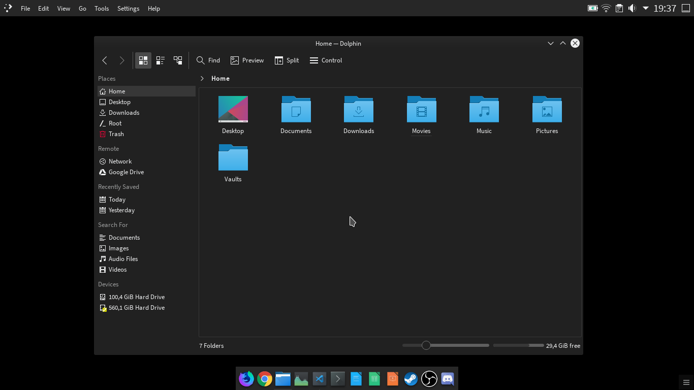

# Nova Dark (KDE colorscheme)
A Dark color theme for KDE Plasma

### Installing

- Open ```System Settings > Colors```, click on  ```Install from File...``` and select ```NovaDark.colors```

### Screenshots



